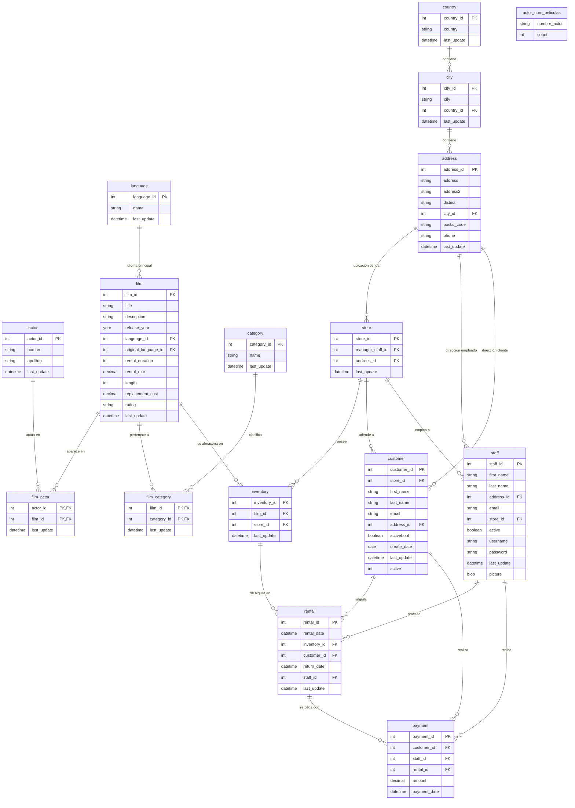

# Esquema Entidad-Relación de la Base de Datos (Sakila)

Este diagrama representa la estructura de tablas, claves primarias (PK), claves foráneas (FK) y sus relaciones.

```mermaid
erDiagram
    actor ||--o{ film_actor : "actúa en"
    film ||--o{ film_actor : "aparece en"
    
    category ||--o{ film_category : "clasifica"
    film ||--o{ film_category : "pertenece a"
    
    language ||--o{ film : "idioma principal"
    
    film ||--o{ inventory : "se almacena en"
    store ||--o{ inventory : "posee"
    
    inventory ||--o{ rental : "se alquila en"
    customer ||--o{ rental : "alquila"
    staff ||--o{ rental : "procesa"
    
    customer ||--o{ payment : "realiza"
    staff ||--o{ payment : "recibe"
    rental ||--o{ payment : "se paga con"
    
    store ||--o{ customer : "atiende a"
    store ||--o{ staff : "emplea a"
    
    address ||--o{ store : "ubicación tienda"
    address ||--o{ staff : "dirección empleado"
    address ||--o{ customer : "dirección cliente"
    
    city ||--o{ address : "contiene"
    country ||--o{ city : "contiene"

    actor {
        int actor_id PK
        string nombre
        string apellido
        datetime last_update
    }

    film {
        int film_id PK
        string title
        string description
        year release_year
        int language_id FK
        int original_language_id FK
        int rental_duration
        decimal rental_rate
        int length
        decimal replacement_cost
        string rating
        datetime last_update
    }

    film_actor {
        int actor_id PK, FK
        int film_id PK, FK
        datetime last_update
    }

    category {
        int category_id PK
        string name
        datetime last_update
    }

    film_category {
        int film_id PK, FK
        int category_id PK, FK
        datetime last_update
    }

    language {
        int language_id PK
        string name
        datetime last_update
    }

    inventory {
        int inventory_id PK
        int film_id FK
        int store_id FK
        datetime last_update
    }

    rental {
        int rental_id PK
        datetime rental_date
        int inventory_id FK
        int customer_id FK
        datetime return_date
        int staff_id FK
        datetime last_update
    }

    payment {
        int payment_id PK
        int customer_id FK
        int staff_id FK
        int rental_id FK
        decimal amount
        datetime payment_date
    }

    customer {
        int customer_id PK
        int store_id FK
        string first_name
        string last_name
        string email
        int address_id FK
        boolean activebool
        date create_date
        datetime last_update
        int active
    }

    store {
        int store_id PK
        int manager_staff_id FK
        int address_id FK
        datetime last_update
    }

    staff {
        int staff_id PK
        string first_name
        string last_name
        int address_id FK
        string email
        int store_id FK
        boolean active
        string username
        string password
        datetime last_update
        blob picture
    }

    address {
        int address_id PK
        string address
        string address2
        string district
        int city_id FK
        string postal_code
        string phone
        datetime last_update
    }

    city {
        int city_id PK
        string city
        int country_id FK
        datetime last_update
    }

    country {
        int country_id PK
        string country
        datetime last_update
    }

    actor_num_peliculas {
        string nombre_actor
        int count
    }
```
